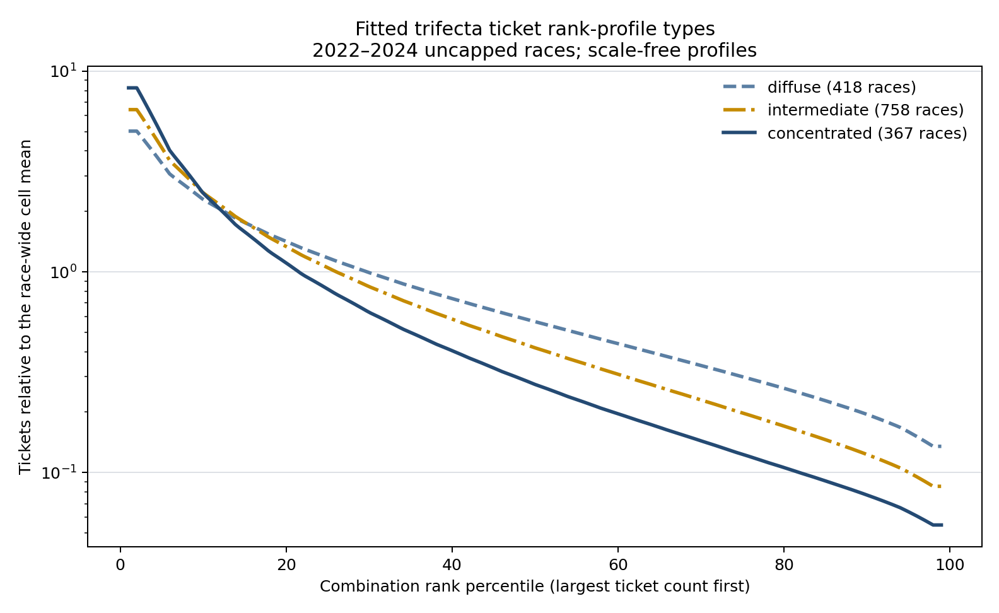
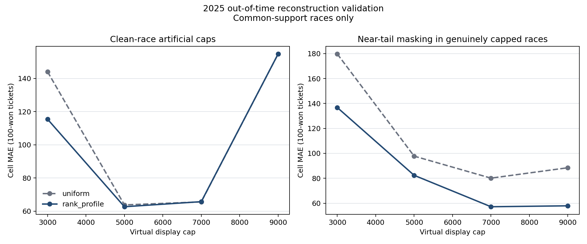

# 순위분포 유형을 이용한 `9999.9` 마권 수 모형복원

## 기술 요약

2022--2024년 실제 `9999.9`가 없는 1,543개 경주의 완전한 삼쌍승 마권표를 규모와 무관한 순위곡선으로 바꾸고, 분산형·중간형·집중형 세 유형을 적합했다. 2025년과 실제 상한 경주는 모형 적합에 사용하지 않았다.

출전두수별 학습경주가 20개 이상이고 조합당 마권 밀도가 학습표본의 5--95% 안인 공통지지 구간에는 실제 상한 7,546경주 중 4,398경주(58.3%)가 들어간다. 나머지는 외삽으로 따로 표시한다.

모형은 회계적 식별집합을 대체하지 않는다. 각 경주의 관측 매출액과 가시 배당의 정수구간만으로 계산한 잔여총량 중간값, 그리고 가시적인 고빈도 머리에 가장 가까운 유형을 이용한 조건부 점추정이다. 잔여총량의 하한·중간·상한과 세 유형을 모두 움직인 모형범위도 함께 저장한다.

## 세 가지 순위분포 유형

| 유형 | 학습경주 | 출전두수 중앙 | 셀당 마권 중앙 | 상위 1%/10%/25% 마권 비중 |
| --- | ---: | ---: | ---: | ---: |
| diffuse | 418 | 10 | 4969.3 | 5.2%/37.7%/62.8% |
| intermediate | 758 | 10 | 6346.4 | 6.7%/46.3%/71.4% |
| concentrated | 367 | 8 | 12331.4 | 8.9%/56.9%/79.8% |

곡선은 각 셀의 마권 수를 그 경주의 셀당 평균 마권 수로 나눈 값이다. 따라서 매출 규모가 다른 경주도 형태만 비교한다. 유형 수 3은 결과를 본 뒤 늘리지 않고 해석 가능한 최소 혼합으로 고정했다.

## 2025년 시간외 검증

| 검증표본 | 가상상한 | 지지 | 모형 | 경주 | 평가셀 | 셀 MAE | log1p RMSE | 정확일치 | 순위 MAE |
| --- | ---: | --- | --- | ---: | ---: | ---: | ---: | ---: | ---: |
| capped_near_tail_2025 | 3000.0 | 밖 | rank_profile | 654 | 238,430 | 172.545 | 0.3856 | 0.22% | — |
| capped_near_tail_2025 | 3000.0 | 안 | rank_profile | 1,190 | 328,350 | 136.735 | 0.3148 | 0.27% | — |
| capped_near_tail_2025 | 3000.0 | 밖 | uniform | 654 | 238,430 | 225.289 | 0.4363 | 0.15% | — |
| capped_near_tail_2025 | 3000.0 | 안 | uniform | 1,190 | 328,350 | 179.693 | 0.3489 | 0.16% | — |
| capped_near_tail_2025 | 5000.0 | 밖 | rank_profile | 654 | 140,159 | 107.672 | 0.3310 | 0.35% | — |
| capped_near_tail_2025 | 5000.0 | 안 | rank_profile | 1,190 | 181,564 | 82.384 | 0.2595 | 0.46% | — |
| capped_near_tail_2025 | 5000.0 | 밖 | uniform | 654 | 140,159 | 150.078 | 0.4319 | 0.19% | — |
| capped_near_tail_2025 | 5000.0 | 안 | uniform | 1,190 | 181,564 | 97.764 | 0.2794 | 0.33% | — |
| capped_near_tail_2025 | 7000.0 | 밖 | rank_profile | 654 | 71,441 | 77.614 | 0.3083 | 0.52% | — |
| capped_near_tail_2025 | 7000.0 | 안 | rank_profile | 1,190 | 86,025 | 57.175 | 0.2318 | 0.72% | — |
| capped_near_tail_2025 | 7000.0 | 밖 | uniform | 654 | 71,441 | 133.536 | 0.4566 | 0.14% | — |
| capped_near_tail_2025 | 7000.0 | 안 | uniform | 1,190 | 86,025 | 80.112 | 0.2894 | 0.33% | — |
| capped_near_tail_2025 | 9000.0 | 밖 | rank_profile | 654 | 20,575 | 72.361 | 0.3235 | 0.43% | — |
| capped_near_tail_2025 | 9000.0 | 안 | rank_profile | 1,176 | 22,644 | 57.914 | 0.2647 | 0.60% | — |
| capped_near_tail_2025 | 9000.0 | 밖 | uniform | 654 | 20,575 | 130.351 | 0.4899 | 0.00% | — |
| capped_near_tail_2025 | 9000.0 | 안 | uniform | 1,176 | 22,644 | 88.452 | 0.3403 | 0.00% | — |
| clean_2025 | 3000.0 | 밖 | rank_profile | 46 | 5,505 | 165.496 | 0.2170 | 0.31% | 38.975 |
| clean_2025 | 3000.0 | 안 | rank_profile | 489 | 55,610 | 115.431 | 0.2106 | 0.35% | 24.646 |
| clean_2025 | 3000.0 | 밖 | uniform | 46 | 5,505 | 210.369 | 0.2587 | 0.13% | 210.286 |
| clean_2025 | 3000.0 | 안 | uniform | 489 | 55,610 | 144.016 | 0.2497 | 0.19% | 143.914 |
| clean_2025 | 5000.0 | 밖 | rank_profile | 38 | 1,733 | 89.826 | 0.1626 | 0.35% | 39.738 |
| clean_2025 | 5000.0 | 안 | rank_profile | 406 | 16,101 | 62.706 | 0.1620 | 0.58% | 28.006 |
| clean_2025 | 5000.0 | 밖 | uniform | 38 | 1,733 | 93.956 | 0.1621 | 0.29% | 93.826 |
| clean_2025 | 5000.0 | 안 | uniform | 406 | 16,101 | 63.809 | 0.1593 | 0.50% | 63.654 |
| clean_2025 | 7000.0 | 밖 | rank_profile | 26 | 386 | 89.585 | 0.2450 | 0.00% | 82.373 |
| clean_2025 | 7000.0 | 안 | rank_profile | 270 | 3,197 | 65.764 | 0.2504 | 0.53% | 62.564 |
| clean_2025 | 7000.0 | 밖 | uniform | 26 | 386 | 88.596 | 0.2430 | 0.52% | 88.477 |
| clean_2025 | 7000.0 | 안 | uniform | 270 | 3,197 | 65.633 | 0.2494 | 0.47% | 65.517 |
| clean_2025 | 9000.0 | 밖 | rank_profile | 10 | 25 | 214.320 | 0.6183 | 0.00% | 214.320 |
| clean_2025 | 9000.0 | 안 | rank_profile | 95 | 261 | 154.766 | 0.6228 | 0.00% | 154.766 |
| clean_2025 | 9000.0 | 밖 | uniform | 10 | 25 | 214.320 | 0.6183 | 0.00% | 214.320 |
| clean_2025 | 9000.0 | 안 | uniform | 95 | 261 | 154.766 | 0.6228 | 0.00% | 154.766 |
| winning_capped | 9999.9 | 밖 | rank_profile | 31 | 31 | 38.290 | 0.2846 | 0.00% | — |
| winning_capped | 9999.9 | 안 | rank_profile | 12 | 12 | 56.750 | 0.3710 | 0.00% | — |
| winning_capped | 9999.9 | 밖 | uniform | 31 | 31 | 60.710 | 0.4561 | 0.00% | — |
| winning_capped | 9999.9 | 안 | uniform | 12 | 12 | 45.250 | 0.3498 | 0.00% | — |

`clean_2025`는 상한 없는 경주의 고배당 꼬리를 가리고 정답 전체를 평가한다. `capped_near_tail_2025`는 실제 `9999.9`가 있는 경주에서 상한 바로 아래의 점식별 셀을 추가로 가린 뒤 그 셀만 평가한다. 두 검증 모두 숨긴 셀의 실제 합계를 입력하지 않고 매출액·가시 배당·셀별 상한으로 잔여총량 구간을 만든 뒤 중간값을 쓴다. 두 번째 검사가 목표 자료의 출전두수와 유동성 이동을 더 직접 반영한다. `winning_capped`는 지급배당으로 마권 수가 드러난 당첨 선택표본이므로 외부 진단일 뿐 전체 상한 셀의 무작위 검증이 아니다.

## 전체 상한 경주의 조건부 복원

최우선 유형은 분산형 45경주(0.6%), 중간형 1,008경주(13.4%), 집중형 6,493경주(86.0%)다. 최우선 유형확률의 중앙값은 77.0%다. 목표경주가 집중형에 크게 몰리므로 세 유형을 안정적인 잠재 집단으로 해석하지 않고 꼬리모양 시나리오로만 쓴다.

잔여총량 중간값과 최우선 유형으로 채운 점추정에서 무투표 셀은 0개다. 잔여총량 하한·중간·상한과 세 유형을 모두 조합한 모형범위의 총 무투표 수는 0--3,924개다. 이는 회계적 sharp 구간이 아니라 선택한 세 순위분포 유형 안에서의 조건부 범위다.

경주별 유형확률과 추정 무투표 수는 `데이터/rank_profile_imputation_races.csv.gz`, 조합별 점추정·모형범위·회계범위는 `데이터/rank_profile_imputed_cells.csv.gz`에 있다.

## 식별 한계와 사용 규칙

1. 실제 0이 학습표본에서 관측되지 않으므로 무투표 수는 분포형태와 정수 총합에서 나온 모형추정이지 자료만의 점식별 결과가 아니다.
2. 순위곡선은 빈칸에 들어갈 숫자 묶음을 예측한다. 개별 조합 배정은 가시 셀의 1·2·3착 주변빈도 곱에 의존하므로 별도의 오차 원천이다.
3. 공통지지 밖 경주는 외삽이다. 특히 학습경주가 20개 미만인 출전두수는 결과표에는 남기되 대표 추정이나 검증 성공률에 섞지 않는다.
4. 다른 승식과 실제 착순·지급배당은 점추정의 입력으로 사용하지 않는다. 이 자료는 사후 외부검증에만 사용한다.
5. 논문이나 후속 분석에서는 회계적 부분식별 구간을 주결과로 유지하고, 여기의 수치는 명시적으로 `모형 기반 복원` 또는 `조건부 추정`이라고 부른다.

## 판정

실제 상한 경주의 근접꼬리 가상검열에서는 공통지지 안팎과 네 상한값 모두에서 순위분포 모형의 셀 MAE가 균등배분보다 낮다. 따라서 순위형태를 옮겨 쓰는 발상은 조건부 복원모형으로 유지할 가치가 있다. 다만 정상경주의 7,000·9,000배 검증은 우위가 없고, 지급배당 선택표본의 공통지지 안 12건에서는 균등 MAE가 더 낮다. 그러므로 현재 결과는 숫자 묶음의 꼬리형태에 대한 증거이지, 특정 조합별 추정치나 무투표 개수의 점식별 증거가 아니다.
